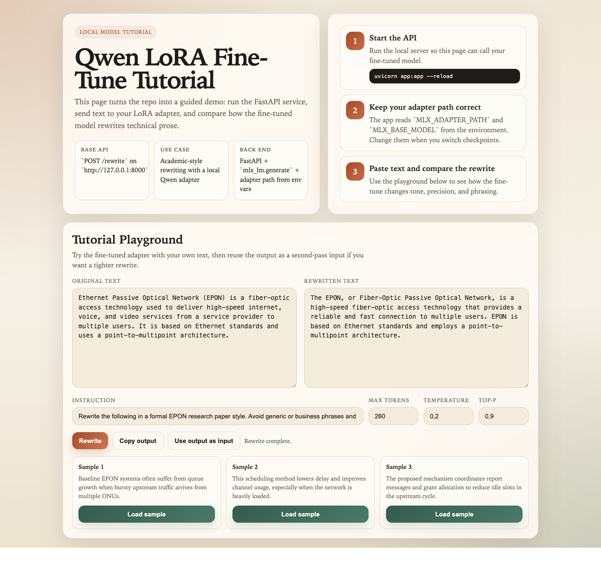
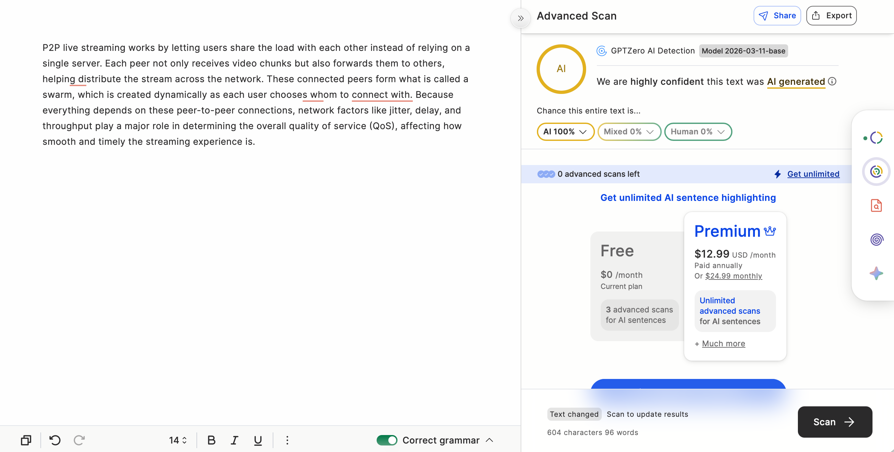
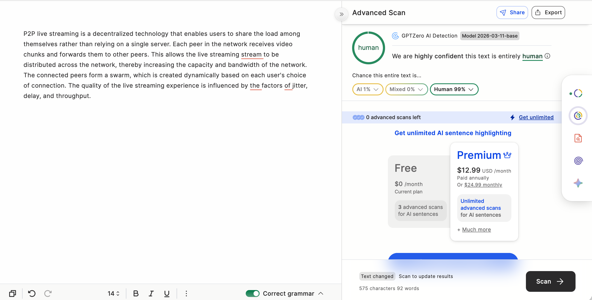

# 🎓 academic-paraphraser-mlx

Fine-tune a small Qwen model with MLX so it can rewrite technical and academic text in your own writing style.

This project is built for lecturers, researchers, and academic writers who want a focused writing assistant rather than a general chatbot. The goal is to make the model write more like you: your tone, your academic phrasing, and your way of presenting technical ideas, while still preserving the original meaning of the source text.

## ✨ Why This Project Is Useful

- paraphrase your own technical sentences in a style that sounds closer to your papers
- revise lecture material, journal drafts, and research notes more consistently
- keep the workflow local on Apple Silicon
- serve the model through a simple API and browser UI

## 🧭 What You Will Build

By the end of this tutorial, you will have:

- a LoRA fine-tuned Qwen instruct model
- a dataset of rewrite-style examples
- a FastAPI wrapper for local inference
- a simple frontend for testing paraphrases
- a repeatable workflow for academic writing-style transfer

## 👩‍🏫 Who This Tutorial Is For

- lecturers who want AI assistance without losing their own writing identity
- researchers who want more consistent academic paraphrasing
- students or assistants building a focused academic writing tool
- practitioners learning MLX fine-tuning through a real use case

## 🗂️ Project Structure

```text
academic-paraphraser-mlx/
├── README.md
├── requirements.txt
├── app.py
├── frontend/
│   └── rewrite_frontend.html
├── data/
│   ├── train.jsonl
│   ├── valid.jsonl
│   └── test.jsonl
├── docs/
│   ├── 01-overview.md
│   ├── 02-dataset-design.md
│   ├── 03-training.md
│   ├── 04-evaluation.md
│   └── 05-production.md
└── examples/
    ├── base_vs_finetuned.md
    └── prompts.md
```

## 🚀 Quick Start

### 1. Create the environment

```bash
python3 -m venv .venv
source .venv/bin/activate
pip install -r requirements.txt
pip install mlx-lm
```

### 2. Start the API

```bash
uvicorn app:app --reload
```

### 3. Open the browser UI

Use [`frontend/rewrite_frontend.html`](frontend/rewrite_frontend.html) to test the paraphrasing flow.

## 🖼️ Demo

Below is a screenshot of the working frontend running locally with the rewrite flow active.



The interface lets you:

- paste an academic or technical paragraph
- apply your fine-tuned rewrite style
- adjust generation settings
- compare the original text with the rewritten result in one view

## 🔬 Base Model vs Fine-Tuned Model

One of the easiest ways to understand the value of the project is to compare the outputs directly.

### Base model impression



- more obviously AI-sounding phrasing
- more explanatory and generic flow
- screenshot example was flagged as `AI 100%`

### Fine-tuned model impression



- more controlled and academic sentence style
- closer to edited technical prose
- screenshot example was labeled `Human 99%`

For the full side-by-side write-up, see [`examples/base_vs_finetuned.md`](examples/base_vs_finetuned.md).

## 📚 Documentation

- [`docs/01-overview.md`](docs/01-overview.md) — what you are building and why
- [`docs/02-dataset-design.md`](docs/02-dataset-design.md) — how to design rewrite-style training data
- [`docs/03-training.md`](docs/03-training.md) — MLX LoRA training workflow
- [`docs/04-evaluation.md`](docs/04-evaluation.md) — how to compare base vs fine-tuned outputs
- [`docs/05-production.md`](docs/05-production.md) — how to serve the model locally

## 💡 Core Idea

This tutorial is valuable because it is honest about the real lesson:

- better dataset design mattered more than chasing lower loss
- instruct models behaved better than small base models
- rewrite-style supervision matched the real use case better than generic QA data

If your goal is academic paraphrasing in your own voice, that is the part that matters most.
